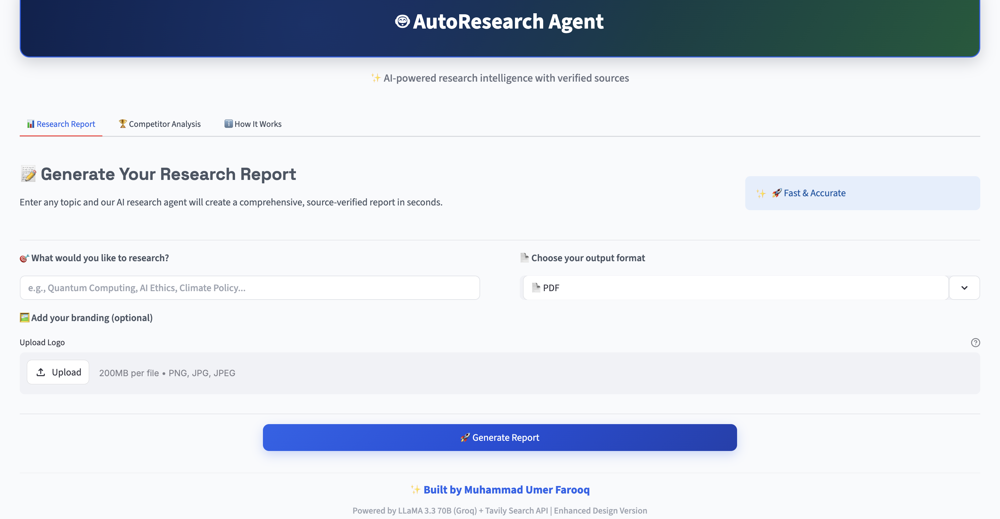
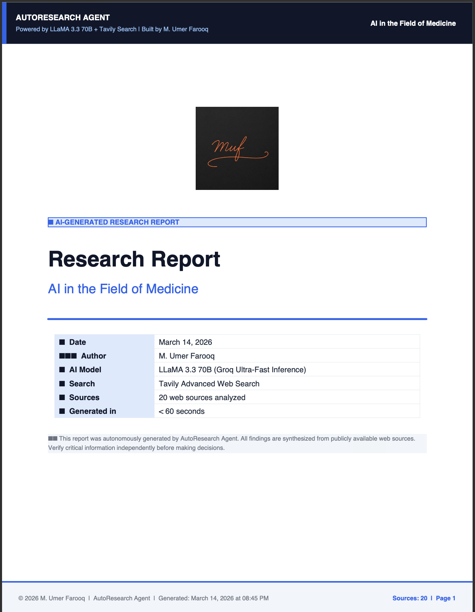

# 🤖 AutoResearch Agent

An autonomous AI research agent that takes any topic, searches the live web, reads multiple sources, and produces a professional PDF research report — all in under 60 seconds.

## ✨ Features
- 🧠 Breaks any topic into targeted sub-questions automatically
- 🔍 Searches the live web using Tavily Search API
- 📊 Synthesizes findings from 12+ sources
- 📄 Generates professional branded PDF, Word, HTML, or Markdown reports
- 🏷️ Custom branding/logo support
- 🏆 Multi-factor source credibility scoring (domain authority, trusted whitelist, content quality)
- 🗂️ Summary table of all sources with metadata
- ⚡ Ultra-fast LLM (LLaMA 3.3 70B via Groq)
- 💾 Caching for faster repeated queries
- 🔧 Modular, extensible, and plugin-ready


## 🌐 Live Demo
👉 [Try it here](https://autoresearch-agent.streamlit.app) — no installation needed


## 🚀 Quick Start

### 1. Clone the repo
```bash
git clone https://github.com/omerfarooq223/autoresearch-agent.git
cd autoresearch-agent
```

### 2. Install dependencies
```bash
pip install -r requirements.txt
```

### 3. Set up API keys
Create a `.env` file:
```
GROQ_API_KEY=your_groq_key
TAVILY_API_KEY=your_tavily_key
```


### 4. Run the agent (Basic)
```bash
python skills/agent.py research "Impact of AI on healthcare"
```

### 5. Output Formats
Generate PDF, Word, HTML, or Markdown:
```bash
python skills/agent.py research "AI in medicine" --format pdf
python skills/agent.py research "AI in medicine" --format word
python skills/agent.py research "AI in medicine" --format html
python skills/agent.py research "AI in medicine" --format md
```

### 6. Custom Branding
Add your logo to the report:
```bash
python skills/agent.py research "AI in medicine" --logo path/to/logo.png
```

### 7. Control Number of Sources
Set sources per sub-question (default 4):
```bash
python skills/agent.py research "AI in medicine" --max-sources 6
```

## 🔑 API Keys (Both Free)
- **Groq API**: https://console.groq.com
- **Tavily API**: https://app.tavily.com


## 🖥️ Streamlit Web UI
You can use the agent with a modern web interface powered by Streamlit.

### 1. Launch the Streamlit app
```bash
streamlit run app.py
```

### 2. Use the UI
- **Research Tab:** Enter a topic, select output format (PDF, Word, HTML, Markdown), and optionally upload a logo. Click "Generate Report" to download the result.
- **Competitor Analysis Tab:** Enter company names (comma-separated), select output format, and generate a competitive analysis report.
- Live progress and results are shown in the browser.

---

## 🛠️ Tech Stack
- **LLM**: LLaMA 3.3 70B via Groq
- **Search**: Tavily Web Search API
- **PDF**: ReportLab
- **UI**: Streamlit
- **Language**: Python 3.x

## 👨‍💻 Author
**M. Umer Farooq**
Built for autonomous research automation.

## 📄 Sample Output
The agent produces a fully formatted report with:
- Executive Summary
- Key Findings (organized by theme)
- Areas of Consensus
- Debates & Controversies
- What Remains Unknown
- Conclusion
- Full Citations
- Summary Table of Sources (with credibility and evidence)

## 🖼️ UI Visual




## 📄 Sample PDF Output
Here is an example of a generated PDF report (cover page and summary table):



## 🆘 Troubleshooting & FAQ
- **API Key Error:** Ensure `.env` contains valid `GROQ_API_KEY` and `TAVILY_API_KEY`.
- **No Results:** Try a broader topic or increase `--max-sources`.
- **Slow Performance:** Cached results are used automatically for repeated queries. Sub-questions are also searched in parallel for ~4x faster results.
- **Custom Logo Not Showing:** Check the image path and format (PNG/JPG recommended).
- **Other Issues:** Delete `.cache/` to clear cache or reinstall dependencies.
